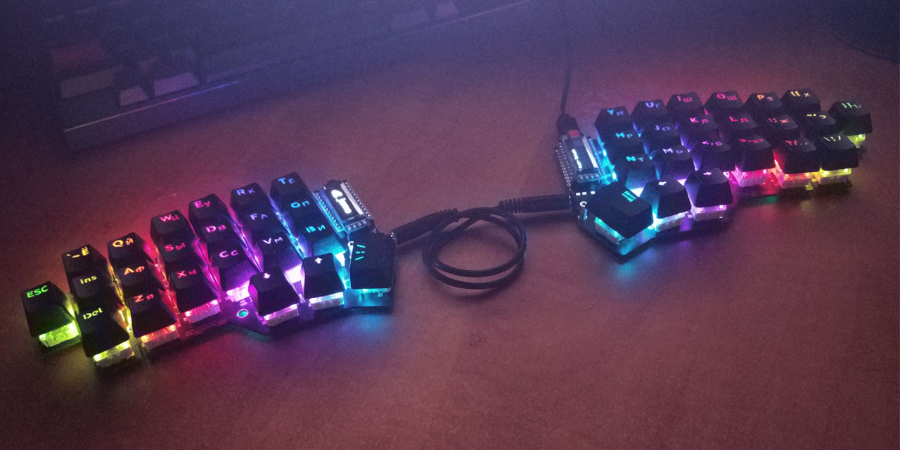
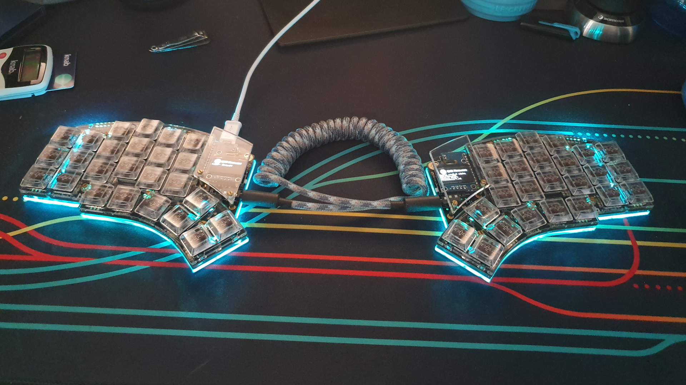

# Corne Build Guide

В этой статье я постараюсь рассказать о том как собрать механическую ортолинейную раздельную беспроводную клавиатуру Corne. И расскажу зачем оно вам нужно.

## Зачем нужны раздельные клавиатуры?

Я уже делал ролик на моем YouTube канале и писал статью про IRIS и там довольно подробно рассказал, зачем нужны раздельные клавиатуры, так что можете посмотреть или почитать. Если кратко, то на обычной клавиатуре у вас руки расположены неправильно. И у вас есть шанс заработать туннельный синдром. 

Да и кроме того, что это неправильно это еще и неудобно. Кисти рук за обычной клавиатурой всегда изогнуты. Стоит только попробовать раздельную клавиатуру, как это становится очевидным.

## Зачем нужна ортолинейность?

Если вы посмотрите на свою клавиатуру, то увидите, что клавиши на ней расположены в шахматном порядке. Как думаете, для чего это? Для того, чтобы вам было удобней? Совсем наоборот. Двести лет назад у нас были печатные машинки и под каждой кнопкой была железячка к которой она крепилась, и эта вот железячка уходила от каждой клавиши вглубь печатной машинки. И если бы клавиши располагались в один столбец, то эти железячки было бы сложно располагать. У нас уже двести лет нет печатных машинок, но клавиши остались на тех же местах. 

Хотя и набирать на них не удобно, так как приходится совершать лишние движения кистью. 

Когда вы сгибаете или разгибаете пальцы они двигаются в одной плоскости, и поэтому ортолинейная клавиатура значительно удобнее, чем обычная.

## Почему именно корне?

Когда я начал использовать IRIS, первые 10 дней я печатал с очень медленной скоростью, но я понимал, что я иду в правильном направлении. Через некоторое время я заметил и удобство, связанное с тем, что рука практически всегда находится в одном положении относительно клавиатуры. 

Второй плюс был в том, что всегда можно расположить клавиатуру под удобным тебе углом, сейчас, например, я сижу на кресле и на подлокотниках у меня две половины клавиатуры. И это значительно удобнее, чем если бы я держал одну большую на коленях.

Третий плюс заключается в том, что сейчас все наиболее часто используемые клавиши находятся под большим пальцем. 

Если вы используете винду и мак, вы уже, скорей всего замечали, что в Windows основная кнопка с помощью которой вы используете почти все горячей клавиши это CTRL (ctrl+c, ctrl+v, ctrl+s) и нажимать ее всегда приходится мизинцем. В MacOS основная CMD, и те же самые сочетания клавиш вы нажимаете с помощью большого пальца, а не мизинца. И это гораздо, ГОРАЗДО удобнее. Для большого пальца естественно изгибаться в разных положениях, относительно того как лежат наши руки. Мизинец устроен гораздо проще, в нем нет такого количества сухожилий. Посмотрите, например, на джойстики, мы с вами отлично управляем двумя стиками с помощью больших пальцев. При этом мизинцем таких точных движений достичь крайне сложно.

После того как начал плотно работать за IRIS я понял, что я больше не хочу возвращаться на обычные клавиатуры. Иногда я их использую, у меня обычная клавиатура за компом где я играю в игры. Но работаю я всегда за раздельной. Я понял, что я хочу двигать рукой еще меньше. Я хочу чтобы и цифры у меня тоже были в слое. 

Но, возможно, к этому нужно придти. Моей первой раздельной клавиатурой была ErgoDox. С нее начинать было проще.

Поэтому, если вы только начинаете погружаться в это, рекомендую что-то похожее на ErgoDox или Moonlander.

## Почему все боятся слоев? 

Обычно люди сильно боятся слоев. Они не понимают как это вообще когда нет цифр. Люди которые совсем далеки от IT пугаются даже 65 процентных клавиатур. Они начинают волноваться, когда не видят Insert или F клавиш. 

Но вот когда нет цифр пугаются все. И всех смущает то, что появляются слои. 

Хотя люди сами не понимают, что они используют слои постоянно и не испытывают с этим абсолютно никаких проблем. 

Например, что вы делаете, чтобы набрать "№" ? Вы набираете его из слоя. И даже не из одного. Вы его забрали сразу же из двух слоев. То есть, для того чтобы достать этот знак, вы во-первых должны быть в слое с русской раскладкой, а потом еще зайти во второй слой с помощью шифта и нажать "3".

А если бы вы были в английской раскладке, то вы бы получили "#"

Как вы справляетесь со всеми этими двухэтажными слоями? Привыкли?

Если вы не любите слои, то вы должны быть последовательными и найти себе клавиатуру где !"№;%:?*(_+) вынесены из слоя. Она будет выглядеть вот так:

Гораздо лучше. Но давайте еще уберем слой из F клавиш. Иначе в этих слоях можно запутаться.

Так, ну подождите, у нас все еще остался слой с разными буквами. Как можно буквы засовывать в слои? Вы в своем уме? Давайте их вынем из слоя. Мы ведь не любим слои. 

Фух. Избавились от слоев. Но подождите даже так у нас все равно остался слой. У нас большие буквы в слое под шифтом. И если мы не любим слои, то мы должны вынести большие буквы отдельно.

## Не нужно бояться слоев

Так вот, слоев бояться не нужно, удобство которое у вас появляется от того, что рука всегда находится в одном положении превышает удобство от наличия отдельного ряда для цифр. Через неделю привыкаешь к тому, что все цифры находятся в слое. 

А все символы находятся не в том же слое, через Shift, а просто рядом ниже. То есть вам не нужно нажимать эту же кнопку плюс еще и Shift для того чтобы набрать символ.

## Пара слов про корне

Corne сделана японцем, которого зовут foostan. Она была основана на Helix, которая сейчас совсем не такая популярная как корне. Сам автор ничего не продает, он все разработал и выложил в открытый доступ.

Купить можно на множестве различных сайтах. Выбирайте любой.

Есть аналог, который называется Jorne для любитетей вымерших русских букв. У этой клавиатуры есть по одной дополнительной кнопки слева и справа. 

Нужно сразу понимать, что клавиатура не продается в готовом виде. Ну, есть сервисы, где за вас ее могут собрать. Но обычно все продается по частям. Как правило в комплекте вы найдете две платы, диоды, светодиоды, хотсвапы. Это нужно будет все спаятьть и собрать. Кроме этого комплекта вам еще понадобятся два микроконтроллера, 42 свитча, 42 кейкапа, TRRS кабель и кабель для подключения к компьютеру.

Про сборку я буду рассказывать в следующей статье.

### Раскладка

Моя раскадка в данный момент времени выглядит так, если вам она нужна вы можете скачать ее в моем гитхабе.

wireless (zmk) - https://github.com/devpew/zmk-config

wired (qmk) - https://github.com/devpew/corne-keyboard-layout

Если посмотрите на картинку то увидите, что черным обозначены кнопки, которые сработают по тапу, красными надписями обозначены кнопки, которые сработают при зажатии. Красной заливкой обозначена кнопка, которую мы удерживаем, при этом значение кнопок меняется.

У меня есть два основных слоя - слой с цифрами и слой с навигацией.

Если вдруг вы подумали, что это слишком сложная раскладка, тут много слоев и мало клавиш, то есть раскладки еще меньше. Например, https://github.com/manna-harbour/miryoku

До этого я еще не дошел, но уже хочется попробовать, смысл в том, что руки у вас в стандартном положении лежат на кнопках ASDF JKL:

И получается, что в этой раскладке вам не приходится ими двигать так интенсивно, как вы это делаете всегда. Если вам нужно ввести большую кнопку с правой половины клавиатуры, то на левой вы зажимаете "F" и нажимаете кнопку. Если нужно нажать большую в левой половине, то на правой зажимаете "J".

## По цене 

По цене самый минимум в который можно постараться уложиться - $127. Пишу цену в долларах, а не в рублях, так как хочу чтобы статья была актуальная хотя бы пол года.

$32 - Цена за две платы версии 3.0.1, в комплекте с диодами, хотсвапами, светодиодами.

$18 - Пара микроконтроллеров Pro Micro

$25 - Корпус из FR4

$10 - Кабели

$28 - Свитчи

$14 - Кейкапы

Если интересно, можете смотреть следующую статью про сборку.

# Build

Я уже пытался делать ролик про Corne, это моя вторая попытка. Примерно три месяца назад я заказывал себе набор. И оказалось, что я допустил довольно много ошибок. 

### Паяльник и флюс

Первая ошибка была в том, что надо было потренироваться паять. Паять я совсем не умел. Еще надо было купить сразу нормальный паяльник. До этого у меня был гигантский советский паяльник у которого жало было с мой кулак.

Сейчас я купил на али нормальную паяльную станцию, с ней стало гораздо проще. Флюс, кстати, тоже советую купить нормальный. У меня была какая-то темно-коричневая канифоль, уже сейчас я понимаю, что это был ужас. На том же али продается отличный флюс в шприцах рублей за 240. Она прозрачная, не так сильно воняет и ее очень легко наносить куда угодно в нужных количествах.

А еще лучшим вариантом будет использовать флюс-карандаш, они не оставляют следов на плате и ее в дальнейшем не нужно будет отмывать.

### Неправильный кейс

Я купил акриловый кейс. Еще в статье про Iris я говорил о том, что акрил это самый ужасный материал для корпуса. Но мне показалось, что акрил будет хорошо смотреться, так как я хотел сделать клавиатуру с подсветкой. 

Оказалось, что в этом корпусе совершенно не держатся свитчи. И проблема не в свитчах, так как не держатся и mx и choc. Просто переворачиваешь клавиатуру и все вываливается. Если вам интересно, то можете посмотреть это в видео, там хорошо это видно.

### Второй неправильный кейс

После этого я покупал еще один кейс. И он тоже совершенно не подойдет для Corne с Choc свитчами. Этот кейс называется "Corne Engineer Keyboard Case".

Во-первых, он пришел с трещиной в среднем слое, хотя сама посылка была хорошо запакована. Я написал в поддержку магазина и мне прислали отдельно вот эту среднюю часть, но прошел еще один месяц.

Вторая проблема в том, что конструктивно этот кейс имеет бортик вокруг кнопок. И если вы будете использовать MX свитчи, то все будет хорошо. Но вот низкие choc нажать большим пальцем невозможно, так как он цепляется за этот бортик. Кнопки в этом корпусе очень сильно утоплены.

Кстати, этот кейс даже спроектирован плохо. Такое ощущение, что человек, который его проектировал сам им никогда не пользовался. Так как тут гнездо для зарядки сделано не в том месте где нужно. И кабель просто не пролезает в отверстие для кабеля, так как порт смещен. В итоге мне пришлось специально искать самый тонкий кабель для того чтобы подключить клавиатуру. Совершенно не рекомендую этот кейс.

И хотя клавиатура с подсветкой в нем хорошо выглядит, но сам кейс мне не нравится.

### Свитчи

Я собрал две клавиатуры. Одну с low-profile свитчами Kailh Choc, а вторую с обычными MX свитчами Zealios v2 от Zeal PC.

Обычные свитчи значительно приятнее в тайпинге, Kailh Choc тонкие примерно как ноутбучные и ощущеия от них примерно такие же. Лично я не любитель тонких ноутбучных клавиатур, поэтому всей прелести этих свитчей я не понимаю.

Абсолютно точно для себя я оставлю вариант с Zealios.

## Что нужно купить

Если вы хотите собрать Corne, то есть два варианта. Первый вариант это купить готовый набор. В нем будут платы и все компоненты, вам нужно будет все спаять. Второй вариант это заказать все самому. Вам нужно будет заказать платы на каком-нибудь сервисе, который их печатает (Например, на https://jlcpcb.com/order)

Так же вам нужно будет купить следующие компоненты:

| Sockets                                        |                                                              |
| ---------------------------------------------- | ------------------------------------------------------------ |
| Reset Button (need 2)                          | [https://s.click.aliexpress.com/e/_98s0pI](https://s.click.aliexpress.com/e/_98s0pI) or https://s.click.aliexpress.com/e/_Ae76Wo |
| Pro Micro (Need 2)                             | [https://www.aliexpress.com/item/32849563958.html](https://www.aliexpress.com/item/32849563958.html) |
| Display (Optional. Need 2)                     | [https://aliexpress.ru/item/32798439084.html](https://aliexpress.ru/item/32798439084.html) |
| Sockets (square)                               | [https://aliexpress.ru/item/622209657.html](https://aliexpress.ru/item/622209657.html) |
| Sockets (rounded)                              | https://s.click.aliexpress.com/e/_98s0pI                     |
| Pins for rounded sockets                       | https://s.click.aliexpress.com/e/_ATiGO0                     |
| Kailh Hot Swap Sockets (need 42)               | https://s.click.aliexpress.com/e/_Arnkja                     |
| Kailh low profile Switch (need 42)             | https://s.click.aliexpress.com/e/_9JyNiU                     |
| Kailh low profile Keycaps (need 42)            | https://s.click.aliexpress.com/e/_9IS4DW                     |
| TSSR connector (need 2 for wired)              | https://s.click.aliexpress.com/e/_ATavWy                     |
| SMD Diodes (need 42) You should buy 1N4148W T4 | https://s.click.aliexpress.com/e/_A3O8Dq or https://s.click.aliexpress.com/e/_A9ugRS or https://s.click.aliexpress.com/e/_ALEzpi |
| Standoff Screw Spacer (need 10)                | https://s.click.aliexpress.com/e/_AmT8DQ                     |
| Socket Head Cap Screws (need 10)               | https://s.click.aliexpress.com/e/_99WIwo                     |
| TRRS Cable                                     | https://s.click.aliexpress.com/e/_A26gtI                     |

LED (Optional):

| SK6812 Mini 3535 (for v.2.0 or v.2.1, need 54) | https://s.click.aliexpress.com/e/_A5Dy4G           |
| ---------------------------------------------- | -------------------------------------------------- |
| SK6812 Mini 5050 (for v.3.0.1, need 12)        | https://s.click.aliexpress.com/e/_A5Dy4G           |
| SK6812 MINI-E (for v.3.0.1 need 42)            | https://www.aliexpress.com/item/4000475685852.html |

Also, useful things:

| Soldering station                              | https://s.click.aliexpress.com/e/_AfojQk                     |
| ---------------------------------------------- | ------------------------------------------------------------ |
| Soldering Iron Tips Repalcement Soldering Bits | https://s.click.aliexpress.com/e/_AkvAW0                     |
| Transparent Flux                               | https://s.click.aliexpress.com/e/_9QBaRi                     |
| Stem holder                                    | https://s.click.aliexpress.com/e/_Ad086s                     |
| Lube for switches                              | https://s.click.aliexpress.com/e/_ADpCDO                     |
| SA Keycaps                                     | https://s.click.aliexpress.com/e/_AcDx9w                     |
| 110mA battery                                  | https://aliexpress.ru/item/4000336502739.html                |
| Zealios V2                                     | https://s.click.aliexpress.com/e/_A48mfw                     |
| XIAOMI Mijia Wowstick                          | [https://s.click.aliexpress.com/e/_9i4jEB](https://s.click.aliexpress.com/e/_9i4jEB) |
| Magnetic Screwpad                              | https://s.click.aliexpress.com/e/_A6N17v                     |
| Filmings                                       | https://s.click.aliexpress.com/e/_9RiYF5                     |
| Keycap Remover                                 | https://s.click.aliexpress.com/e/_ABFr9V                     |
| Swithces Remover                               | https://s.click.aliexpress.com/e/_AT4cuP                     |
| Switch Opener                                  | https://s.click.aliexpress.com/e/_AOCn99                     |
| Nice cover                                     | https://s.click.aliexpress.com/e/_9HZo4P                     |
|                                                |                                                              |

### Сокеты

В первом гайде который я нашел человек впаивал котроллер сразу в плату. Я это повторил за ним и потом сильно пожалел. Так что рекомендую не впаивать контроллер сразу же в плату, а впаять в плату сокеты, а в контроллер ножки. Для того, чтобы в будещем можно было поменять контроллер. 

Довольно хорошую подборку по сокетам делал Жорик - https://github.com/joric/nrfmicro/wiki/Sockets

В будущем вы захотите сделать вашу клавиатуру беспроводной. Вам не нужно будет ничего выпаивать, вам просто нужно будет вынуть этот контроллер и установить другой. То же самое касается и экрана, не впаивайте, а ставьте через сокеты.

Сами сокеты я видел трех видов. Самые обычные сокеты они прямоугольной формы, продаются в любом магазене. Минус их в том, что они огромные. В магазинах довольно трудно найти низкие, а высокие смотрятся просто ужасно. Они на фотографии в нижнем ряду. В них вставляются стандартные квадратные пины, которые идут вместе с контроллером.

Есть такие же только ниже, на фото слева внизу, такие в магазинах я найти не смог, но их полно на алиекспрессе. К сожалению по правилам хабра я не могу вставлять ссылки, но вы можете найти их в ютубе под видео. Они смотрятся значительно лучше.

Самым удобным вариантом для меня оказались те что сверху. Они мне показались удобнее, и к тому же под них помещается 110mAh батарея, если вдруг вы будете делать беспроводную клавиатуру. При этом стоят они довольно дешево. Так что именно их я и рекомендую. 

Сокеты круглые - https://www.aliexpress.com/item/32892386779.htm или https://www.aliexpress.com/item/32847384633.html

Сокеты квадратные - https://aliexpress.ru/item/622209657.html

Пины к круглым советам - https://s.click.aliexpress.com/e/_AKfdZK

Есть сокеты совсем низкие, они называются "Mill Max Low Profile Sockets" они продаются в некоторых магазинах, они совсем тонкие, идут в комплекте с ножками. Проблема в том, что во-первых довольно сложно найти такие ножки отдельно. До этого момента я так и не смог это сделать.Но они довольно дорогие, комплект из сокетов с ножками стоит около семи долларов. 

https://splitkb.com/products/mill-max-low-profile-sockets?variant=31945995845709

https://www.littlekeyboards.com/collections/miscellaneous/products/mill-max-ultra-low-profile-sockets

### Hotswap

Рекомендую покупать версию с Hotswap, вообще в 2021 году, все клавиатуры должны быть с hotswap. В любом случае со временем свитчи нужно будет обслуживать. Либо у вас появится желание попробовать другие свитчи. 

Сам я буду собирать две версии, одну с hotswap, вторую нет. Просто потому, что у меня остался акриловый корпус в котором не держатся свитчи, их туда можно только припаять, чтобы они постоянно не выпадали. Поэтому я решил заказать плату и впаять, просто чтобы не выбрасывать корпус.

### Контроллер

Если вы хотите собрать проводную версию, то у вас два варианта - ProMicro и Elite-C v4. Не знаю какие там технические отличия, но для нас, для пользователей разница в том, что первых с micro usb, второй с type c. Вам нужно два контроллера. Кстати, можете купить один ProMicro и один Elite-C v4 чтобы сэкономить и они будут хорошо работать вместе.

Elite-c купить значительно сложнее, чем promicro. И стоит он в два раза дороже. ProMicro можно купить на али довольно дешево.

ProMicro - [https://www.aliexpress.com/item/32849563958.html](https://www.aliexpress.com/item/32849563958.html)

Если хотите собрать беспроводную, то есть два варианта - nice!nano и nfrmicro. Nice!nano нет в продаже уже больше четырех месяцев. А вот nfrmicro найти можно.

### Корпус

Есть довольно большое количество корпусов, которые вы можете использовать с Corne. Акриловый, Пластиковый распечатанный на 3D принтере, стальной, алюминиевый, FR4.

#### Акрил

Не рекомендую брать акриловый вариант. Во-первых, в нем очень плохо держатся свитчи. Они буквально выпадают из него, когда переворачиваешь клавиатуру. Можете посмотреть это в моем видео. Во-вторых, он очень быстро царапается, внешний вид очень быстро портится и на прозрачном акриле сразу же заметня любые мелкие царапины.

Есть еще Frosted acrylic, на нем царапины выглядят не так ужасно, и он очень красиво рассеивает подсветку.

При этом, акриловые корпуса могут выглядеть крайне эффектно, если планируете использовать подсветку.

С визуальной точки зрения мне нравится корпус который называется "Corne Engineer Keyboard Case" там очень хорошо рассеивается подсветка. Но мне не нравится тайпинг в акриловых корпусах, звук от них какой-то неправильный. Но этот корпус не получится использовать. с низкопрофильными свитчами.

#### Пластиковый распечатанный на 3д принтере

Никогда не пробовал. Если вы вдруг знаете где можно заказать или купить корпус для корне напечатанный на 3д принтере, то дайте знать.

#### Стальной

Не использовал стальной корпус в Corne, но больше полу года использовал стальной в IRIS, и мне он очень нравится. Он не царапается, и не царапает руки (это обычно самый популярный вопрос про металлические корпуса). Он всегда приятно холодный и клавиатура в нем всегда тяжелая. Мне нравится тайпинг в стальном корпусе. 

Выглядит стальной, кстати, тоже довольно эффектно.

Наверное, из минусов стального корпуса можно отметить только то, что нужно всегда следить за расстоянием до платы.

#### Алюминиевый

Сильно похож на стальной, но при этом легкий. Стоит очень дорого, из-за такой высокой цены не могу его рекомендовать. 

Второй его минус в том, что на нем остаются следы от рук, на стальном это практически незаметно. И эти следы довольно сложно убрать, так как сам алюминий немного "шершавый".

Кроме того, опять же, алюминий не диэлектрик и нужно оставлять зазор между ним и платой и из-за этого высота у клавиатуры будет больше, чем в случае с FR4 корпусом.

#### FR4

FR4 это такой материал, из которого делают печатные платы. И изначально мне казалось, что это вообще не корпус, а просто какой-то костыль, который можно использовать только пока ты не нашел нормальный корпус. Но как оказалось, это очень хороший вариант. 

Он не плохо выглядит, при это еще и стоит копейки. В FR4 нет этих ужасных звуков как у акриловых корпусов. В общем довольно дешевый и практичный вариант. Но, возможно, с эстетической стороны не всем он по душе.

Еще нравится и то, что можно без проблем прижать максимально близко к плате не боясь, что замкнутся контакты.

#### IMK

Еще есть корпус, который я не пробовал, но очень хочу попробовать. Если вдруг знаете, где его можно найти, то свяжитесь со мной. Этот корпус называется IMK, уже несколько месяцев их нет в продаже. Сверху этот корпус металлический, но снизу у него прозрачная часть из Frosted Acrylic. Выглядит он интереснее, чем все остальное.

### Corne Switch Plate Foam

Обычно в клавиатуры прокладывают шумоизоляцию, так как иногда бывают посторонние вибрирующие звуки от корпуса. 

Для Corne вы тоже можете купить такую вот пластину из мягкого материала, которая устанавливается между PCB и плейтом.

В случае с Corne это довольно бесполезная вещь. По сути, после ее установки не меняется ничего. Но если вдруг, вы в своей корне ощущаете некоторую гулкость, то можете попробовать.

### Платы

Клавиатура, которую собираю я называется Corne. Но есть и аналоги, которые сильно на нее похожи. Например, https://github.com/joric делает клавиатуру, которая является форком corne, но с двумя дополнительными кнопками по бокам. Она называется https://github.com/joric/jorne. Это нужно если хотите вместить еще две кнопки - ё и ъ. Я ими не пользуюсь в принципе. Поэтому мой выбор пал на корне.

Так же есть довольно похожая, но с большим количеством кнопок под большой палец - Kyria. Но тут нет Hotswap и подсветка тут только снизу.

Если говорить о Corne, то у нас есть три варианта которые мы можем купить. 

* Первый это Corne Classic PCB Kit. Самая первая, самая дешевая версия без hotswap. Рекомендую ее только тем, кто точно знает, что свитчи они будет впаивать. Кроме того мне не понравилось, что тут обычные диоды, а не SMD, впаивать их дольше. В комплекте нет светодиодов, да и сами светодиоды не очень удачные, в следующих версиях corne идут другие светодиоды, с выпирающами ножками, которые значительно удобнее впаивать. Стоит эта версия всего 19 долларов.

  Плата выглядит так:

  

* Второй вариант это версия 2.1 corne Choc Hotswap PCB kit или Corne MX Hotswap PCB Kit. Не плохой вариант, стоит 24 доллара. Тем более если хотите на тонкую клавиатуру с hotswap, это единственный ваш вариант. Но если хотите на нормальных свитчах то рекомендую третий вариант.

  Выглядит вот так:

  

* Третий вариант стоит 36 долларов. Это последняя на данный момент версия 3.0.1, поддерживается тут только MX свитчи и хотсвап. Рекомендую к покупке именно его. В комплекте уже будут диоды, хотсвапы, светодиоды, кнопки сброса и коннектор TRRS. Тут уже другие светодиоды, которые впаивать значительно проще и сама плата стала односторонней. То есть вам будет сложней промахнуться и впаять что-то неправильно.

  Выглядит так:

  

Третий покупать, кстати, разумней всего, так как разница даже с первым не такая большая, но тут в комплекте уже идут светодиоды. Если вы купите первую версию, а потом будете покупать еще и светодиоды, то примерно заплатите примерно столько же.

#### Заказать платы

Можно купить кит для сборки, а можно и заказать все на сервисе, который печаатет PCB. Например, https://jlcpcb.com

Но там можно заказать партии от 5шт.

Вот примерные цены за партию для Corne:

А вот для Jorne:

jiran:

Sofie:

## Сборка

### Паяем сокеты

Сначала надо припаять сокеты к плате. Вставляем сокеты в плату, сразу же можно вставить в них пины.

После этого можно закрепить все это скотчем, чтобы оно не двигалось когда вы это паяете. Переворачиваем и аккуратно припаиваем.

Дальше надеваем нашу промикру и припаиваем ее к пинам

Получится что-то вроде этого:

Тут надо паять довольно аккуратно, не используйте слишком много припоя чтобы не замкнуть контакты.

### Паяем диоды

В первой версии Corne есть два варианта диодов - обычные и SMD. Паять что первые, что вторые довольно просто. Но первые нужно будет еще и обрезать. Мне больше нравится паять мелкие SMD.

Тут обязательно соблюдать полярность. Вот эти мелкие треугольнички должны смотреть на черную полоску.

В последней версии платы вы можете припаять диоды только снизу. А вот во второй версии вы можете припаять их сверху или снизу. Если будете использовать низкопрофильные choc свитчи, то их обязательно припаивать снизу, если впаяете сверху, то свитчи не вставятся.

Примерно это вы должны получить:

### Паяем светодиоды

> Если планируете делать клавиатуру, то настоятельно рекомендую не впаивать светодиоды.

Светодиоды паять сложней всего, как я уже говорил раньше рекомендую купить нормальный паяльник с тонким жалом, флюс-карандаш. Изначально, когда у меня был паяльник с толстым жалом и темная вонючая канифоль у меня получался примерно вот такой вот ужас.

В версии 2.0 и 2.1 используются светодиоды SK6812 Mini 3535, как на картинке выше, мне кажется, что это плохой выбор. У него все контакты на задней стенке. Из-за этого его очень легко сжечь при пайке и еще из-за этого его сложно паять.

SK6812 Mini 3535 - https://aliexpress.ru/item/32623583544.html

В версии 3.0.1 используется не один тип светодиодов, а два разных для подсветки дна и подсветки кнопок. Паять их значительно проще.

Для подсветки дна используются SK6812 Mini 5050 паять их удобнее, так как у них по бокам торчат ушки.

SK6812 Mini 5050 - https://aliexpress.ru/item/32623583544.html

Для подсветки кнопок используются SK6812 MINI-E их паять еще проще и не так страшно их сжечь, так как у них большие контакты.

SK6812 MINI-E - https://www.aliexpress.com/item/4000475685852.html

Тут тоже допустил довольно большую ошибку на которую я потратил кучу времени. На клавиатуре есть обозначения "LED1", "LED2", "LED3" и так далее. И мне показалось, что так обозначается вся цепь по которой они подключены. Я думал, что начну паять с первого, проверю и если все ок, то продолжу дальше. Впаял его, но ничего не работало. Подумал, что дело в прошивке, потратил на это часа 3-4 времени, но так и не решил проблему. Несколько раз перепаивал светодиод думая, что я их постоянно сжигаю. Потом уже просто сдался, решил просто припаять все светодиоды и уже потом решить эту проблему, а пока жить без подсветки, но когда я впаял все светодиоды, то все заработало. Даже с учетом того, что я долгое время мучал первый LED он все равно не сгорел.

Вот правильная схема того, как идет цепь. Backlight и подсветка кнопок в одной цепи. То есть, пока не впаяете первый светодиод, остальные работать не будут, все в одной цепи, подключены последовательно.

Если у вас работает часть подсветки то смотрите на последний, который не горит либо тот что перед ним, скорей всего проблема с ними. Наибольшая вероятность в том, что вы либо сожгли один из них, либо неправильно припаяли. Но так же есть вероятность, что вы плохо приаяли последний в цепи, который горит, проверьте и его.

Но вообще при сборка пайка светодиодов это самое сложное. Во-первых, боишься их сжечь. Даже на сайте предупреждают, что паять их надо при температуре около 270 градусов и желательно как можно меньше касаться паяльником.

Тут еще надо быть аккуратным, так как надо всегда соблюдать правильное положение. По всей плате они расположены в разных положениях. На плате нарисовано как нужно располагать светодиод.

### Припаиваем хотсвапы

С этим проще всего. Они огромные и паять их крайне просто. Не жалейте флюса, на первой клавиатуре, которую я паял, у меня были ситуации, когда я нажимал на кнопку и снизу у меня отрывался хотсвап от платы, приходилось допаивать.

### Прошивка, раскладка, QMK, VIA

Теперь подключаете каждую половину к компу и прошиваете с помощью QMK Toolbox.

Для начала можете использовать стандартную прошивку - https://github.com/foostan/qmk_firmware-hex/releases/download/release-20201208/crkbd_rev1_common_via.hex Это стандартная прошивка. В ней сразу же включена backlight подсветка и подсветка кнопок. В различных гайдах написано, что подсветка по умолчанию не включена, и я долгое время пытался разобраться как ее включить. Но вот в этой прошивке сразу же включена и подсветка и VIA. Вам не нужно будет мучаться с раскладкой, так как тут есть поддержка VIA. То есть вы можете просто закачать прошивку через QMK, а дальше все делать через VIA. В нем все происходит значительно быстрей и удобнее. 

Просто нажимаете на кнопку reset на клавиатуре и после этого нажимаете кнопку Flash в QMK Toolbox.

После этого у вас все должно работать. Можете соединить две половины и подключить это все к компьютеру. Не собирайте клавиатуру, а для начала протестируйте в VIA, что у вас нажимаются все кнопки. Кроме того протестируйте сразу же и подсветку, у меня были ситуации когда подсветка работала, но иногда начинала сходить с ума, то есть моргать странным образом. Такое тоже может быть если у светодиодов плохие контакты.

# Wireless

## Контроллер

Сейчас на рынке есть два распространенных контроллера - nice!nano и nrfmicro. Первого нет в продаже уже больше трех месяцев. Второй делают энтузиасты, вы можете без проблем купить его.

Оба этих контроллера по габаритам такие же как Pro Micro, но только у них есть BLE на чипе nRF52840.

Вот что пишут Nice!nano про разницу между этими двумя контроллерами: "The nRFmicro is extremely similar to the nice!nano. The main difference is  depending on the version of the nRFMicro, the power system would be  slightly different from the nice!nano. From a usability standpoint, very little is different. The nice!nano exposes more pins and is thinner  than older versions of the nRFMicro. The biggest difference is that the  nice!nano is prebuilt and has a large user base, which therefore has a  bigger support community. The BlueMicro is basically the same story  except for the nRF52832 versions don't support USB."

## Сокеты

Как и в прошлой статье, рекомендую вам использовать сокеты, а не впаивать контроллер в плату. Про сокеты я писал в предыдущей статье. Единственное, что с этими контроллерами нужно быть аккуратнее, рекомендуется ставить температуру на паяльнике примерно 270-300 градусов чтобы не повредить чип nRF52840.

## Батарея

Для того, чтобы клавиатура начала работать без провода вам нужна литиевая rechargeable батарея на 3.7v. 

В любом магазине электроники таких батарей вагон и маленькая тележка, в среднем они продаются по цене от 150 до 400 рублей за штуку. Вы можете выбрать как совсем крошечную батарею на 110mA, которая поместится под сам контроллер, либо можете взять большую батарею и установить ее в дно корпуса. Рекомендую смотреть на тонкие модели, которые в толщину не больше 5мм.

Все рекомендуют батарею 301230, она 110mA, толщиной всего 3мм, и хватать вам ее будет на неделю. Вы можете заказать ее на али, но учтите, что батареи не перевозят самолетами, так что ехать она к вам будет пару месяцев. Лучше пойти в магазин электроники и купить ее там. Тем более что цена практически такая же.

При этом производители батареи всегда немного обманывает с толщиной. Вот реальная толщина данных батарей.

Реальная толщина между днищем и платой у меня получилась чуть больше 6мм. Общая толщина полтора сантиметра. А полная высота клавиатуры 3 с половиной. Это с учетом того, что тут стоят самые высокие кейкапы SA профиля.

Батареи в клавиатуре будут разряжаться неравномерно, так как только левая половина клавиатуры коннектится к компьютеру, а правая коннектится к левой. Получается, что левая часть будет разряжаться быстрее, чем правая. Вы можете посчитать все по этой ссылке - https://zmk.dev/power-profiler/

Например, если вы будете использовать самую маленькую батарею 110mA в обеих половинах клавиатуры, заряда вам хватит на 6 дней и 15 часов (плюс-минус два дня), это в случае если вы не будете использовать сон. Если включите сон, и клавиатура у вас будет спать 70 процентов времени, вам хватит заряда на две недели и три дня. Речь идет про левую половину клавиатуры. Правая живет примерно в два раза дольше.

Я выбрал батарею 1200mA для левой половины и 700mA для правой. Полностью отключил сон. Выбрал такую потому, что просто хочется реже отвлекаться на ее зарядку. 

При такой моей конфигурции калькулятор говорит мне, что заряда в левой половине мне хватит на 2 месяца и 4 дня. В правой на 6 месяцев и 3 дня. Пока не удалось это проверить, так как батареи до сих пор не разрядились.

По весу клавиатура тоже довольно легкая. Например, моя прошлая клавиатура IRIS в металлическом корпусе весит в два раза больше. Она проводная.

Кстати, некоторые люди умудряются вставлять AA или AAA батареи. 

Такие вот держатели продаются в магазинах электроники, стоят 21 рубль за штуку. Но у меня так и не получилось как-то адекватно закрепить его. Ну и выглядит клавиатура с такими вот батарейками не очень эстетично.

## Разьем и переключатель

Рекомендую так же поставить разьем на батарею для того чтобы можно было быстро ее отстегнуть без пайки. Если вдруг захотите поменять батарею.

Кроме того, рекомендуется ставить переключатель для того чтобы разрывать цепь 

Для того чтобы можно было выключить клавиатуру полностью, если вы, например, не планируете ей пользоваться какое-то время. С этим сложней, так как технически сложно куда-то приделать этот самый выключатель.

## Зарядка и bluetooth

Нужно помнить, что recharge rate тут будет 100mA, так что большие батареи будут заряжаться довольно долго. Например, чтобы мне полностью зарядить с 0 до 100 процентов мою клавиатуру, мне нужно держать ее на зарядке 12 часов.

Можно использовать клавиатуру пока она заряжается. Вы можете перенастроить вывод нажатий. Например, вы можете подключить по кабелю клавиатуру к первому компьютеру, а печататать на компьютер к которому клавиатура подключенаа по bluetooth. А потом сочетанием клавиш быстро переключиться и печатать уже на том компьютере к которому она подключена по проводу.

Рекомендую так же сразу купить магнитный кабель, так ставить ее на зарядку значительно проще.

## Подсветка и дисплей

Для беспроводной клавиатуры не рекомендую использовать LED подсветку или OLED дисплей, так как они сильно кушают батарею. Вот, что случится с жизнью моей батареи если я подключу подсветку и экран.

|       | без подсветки, без экрана | Подсветка, без экрана | Экран, без подсветки | Подсветка и экран |
| :---- | ------------------------- | --------------------- | -------------------- | ----------------- |
| Left  | 2 months 4 days           | 1 hour 53 minutes     | 1 week 12 hours      | 1 hour 52 minutes |
| Right | 6 months 3 days           | 1 hour 6 minutes      | 4 days 19 hours      | 1 hour 5 minutes  |

При этом, если я верно понял (можете поправить меня в комментариях) даже если вы выключите подсветку программно, то батарея все равно будет расходоваться. Нужно выпаять первый LED в цепи, чтобы батарея не расходовалась.

## ZMK

Для того чтобы прошить вашу клавиатуру вам нужно сгенерировать файл .uf2, делается это довольно просто.

Вам нужно установить zmk, для этого в github создайте пустую репу, при этом не инициализируйте ничего и не создавайте .README файла, просто создайте пустую репу.

Далее устанавливайте ZMK

 например, находится по адресу https://github.com/devpew/zmk-config.git Но лучше указать ssh, чтоб не спрашивался пароль git@github.com:devpew/zmk-config.git 

После этого ZMK у вас спросит какая у вас клавиатура, выбирайте crkbd и спросит какой у вас контроллер. Выбирайте nice!nano.

Теперь если у вас nice!nano, то делать ничего не нужно, а если у вас nfrmicro, то пойтиде в файл zmk-config/.github/workflows/**build.yml** и поменяйте там nice!nano на nrfmicro_13 

Можете посмотреть как это сделано у меня - https://github.com/devpew/zmk-config/blob/master/.github/workflows/build.yml

(У вас скорей всего будет контролле nrfmicro 1.4, но ставить в конфиге все равно нужно nrfmicro_13)

После этого все должно работать.

Теперь идите в файл zmk-config/blob/master/config/corne.keymap

Это файл вашей раскладки. Можете тут что-либо поменять и закомитить изменения. 

После вашего коммита можете пойти в таб "Actions" вы увидите, что верхний экшн компилируется. Обычно это занимает около двух минут. Когда все скомпилируется он станет зеленым.

После этого можете на него нажать и скачать свою прошивку

Вы скачаете архив, который вам нужно будет распаковать. В архиве вы найдете два файла с прошивкой. Для левой и правой половины клавиатуры.

Теперь подключайте левую половину к компу, и быстро нажмите кнопку reset дважды. Откроется окно, в него перетащите файл с прошивкой для левой половины. Файл скопируется и окно закроется. Отключайте, подключайте вторую половину и делайте то же самое.

После того как вы все прошили поставьте две половины рядом и одновременно нажмите на них кнопки reset. После этого правая половина должна подключиться к левой.

Если вдруг у вас есть какие-то проблемы, то можете сделать ресет. Это полностью сбросит контроллер. Файл с ресетом можете скачать тут - https://github.com/devpew/corne-wireless/tree/main/nrfmicro_13-settings_reset-zmk

Далее, на клавиатуре выбирайте какой-нибудь профиль и подключайтесь к компьютеру.

В моей прошивке это делается вот так. Можно выбрать какой-либо слот bluetooth, например первый, если вдруг на нем уже что-то есть можете сделать btclt чтобы его очистить, после этого на своем компьютере вы увидите новый девайс "Corne" к которому сможете подключиться. 

С MacOS у меня была довольно странная история, я хотел подключиться к пятому слоту. Потратил на это пол часа но так и не смог, ошибка была в том, что клавиатура подключалась, но не передавались нажатия. При этом к первому слоту я подключился сразу же и без каких-либо проблем. 

На втором слоте у меня подключен айфон, на третьем айпед. Переключения происходят мгновенно.

## Есть ли поддержка QMK?

Нет, поддержки нет, и насколько я понимаю это из-за каких-то проблем с лицензией.

## Есть ли поддержка VIA?

К сожалению тоже нет, нет никакого визульного редактора.

## Нужно ли впаивать TRRS?

Нет.